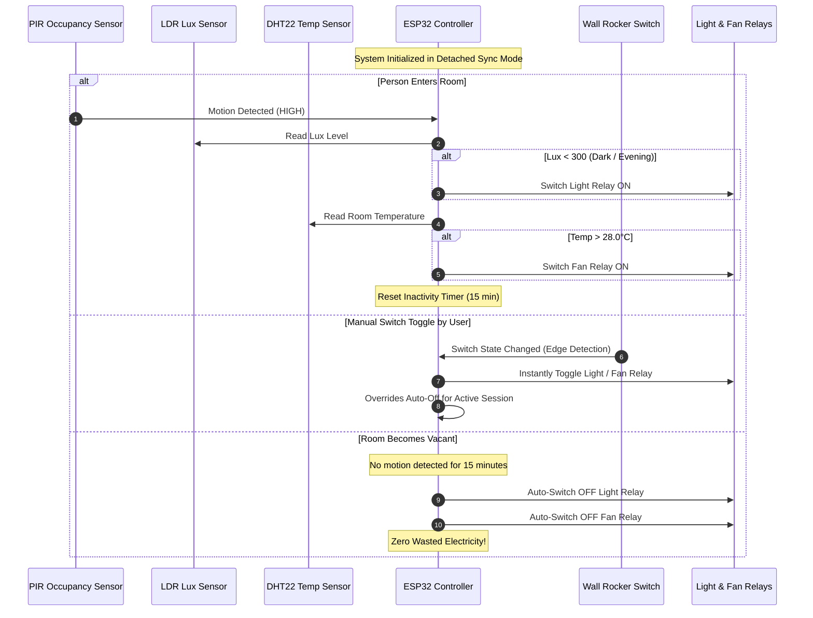

# 18_Real_Home_Installation_Switchboard_Wiring_Guide.md
# Practical Real-Home Installation Guide — Switchboard Wiring, Fan/Light Automation & Snubber Protection

**Target Environment:** Indian Standard Residential 230V AC 50Hz Modular Switchboards (Anchor Roma, Havells, Crabtree, Legrand, Goldmedal)  
**Applicable Nodes:** NODE-D1 (Living Room), NODE-D2 (Master Bedroom), NODE-D3 (Guest Bedroom), NODE-D4 (Kids Bedroom), NODE-B2 (Dining/Kitchen Lights)

---

## 1. Safety & Preparation Rules

> [!CAUTION]
> **HIGH VOLTAGE WARNING:** 230V AC mains electricity can cause severe shock, electrocution, or fire.
> - **Always switch off the main MCB / RCCB** at the distribution board before opening any wall switchboard.
> - Use a certified neon/digital voltage tester to confirm that lines are completely DEAD before touching any terminal.
> - Wear rubber-soled footwear and insulated gloves.

---

## 2. Solving the 3 Classical Home Automation Challenges

### Challenge 1: The Missing Neutral Wire in Switchboards
In many standard Indian households, switchboards only contain the incoming **Phase (Live)** and individual **Switch Legs (Load wires to lights/fans)**. Neutral wires run directly through the ceiling slabs.
- **Solution:** Pull a single 1.0 sq mm neutral wire from the nearest ceiling junction box or 3-pin power socket into the switchboard conduit. The ESP32 and AC-DC power supply module (Hi-Link HLK-PM01 / 5V SMPS) require both Live and Neutral.

### Challenge 2: Family Usability — Manual Wall Switch Synchronization
If you wire an ESP32 relay in series or cut the wall switch, family members turning the mechanical switch OFF will kill power to the automation.
- **Solution (Detached Relay / Dry Contact Sensing):**
  1. The wall switch is disconnected from 230V AC completely.
  2. The switch terminals are connected to an ESP32 GPIO pin and GND.
  3. The ESP32 internal pull-up resistor keeps the pin HIGH.
  4. Flipping the switch pulls the pin LOW/HIGH, triggering an interrupt that toggles the relay coil.
  5. **Result:** Wall switches work instantaneously like standard 2-way switches, and Home Assistant is updated in real-time.

```
+-------------------------------------------------------------------------+
|                  INDIAN MODULAR SWITCHBOARD RETROFIT                    |
+-------------------------------------------------------------------------+

  Mains 230V Live (L) ───────+──────────+────────────────────────────────+
                             │          │                                │
                             │      [Relay 1] (NO) ──> Ceiling Light     │
                             │          │                                │
                             │      [Relay 2] (NO) ──> Ceiling Fan       │
                             │          │                                │
  Mains Neutral (N) ───+─────+          │ [RC Snubber across NO & COM]   │
                       │     │          │                                │
                    [5V 1A Hi-Link SMPS]│                                │
                       │     │          │                                │
                      +5V   GND         │                                │
                       │     │          │                                │
                       ▼     ▼          ▼                                │
                 +--------------------------+                            │
                 |        ESP32-WROOM       |                            │
                 |                          |                            │
                 |  GPIO 19 (Relay 1 Out) ──+                            │
                 |  GPIO 18 (Relay 2 Out) ──+                            │
                 |                          |                            │
                 |  GPIO 25 (Switch 1 In) ──+──[Existing Wall Rocker 1]──+ GND
                 |  GPIO 26 (Switch 2 In) ──+──[Existing Wall Rocker 2]──+ GND
                 |                          |
                 |  GPIO 34 (PIR Occupancy) <──[PIR Sensor AM312/HC-SR501]
                 |  GPIO 33 (LDR Lux In)    <──[LDR Light Sensor Divider]
                 |  GPIO 23 (DHT22 Climate) <──[DHT22 Temp & Humidity]
                 +--------------------------+
```

### Challenge 3: Inductive Kickback from Ceiling Fans
Ceiling fan motors are inductive loads. When a relay turns off a running fan, the collapsing magnetic field creates a back-EMF spike exceeding 600V. This causes relay contact sparking, contact welding, and EMI noise that resets the ESP32.
- **Solution (RC Snubber Protection):**
  - Connect an **RC Snubber** (0.1µF 400V X2 Capacitor + 100Ω 2W Flameproof Resistor) in parallel across the Relay `COM` and `NO` screw terminals.
  - Alternatively, use a pre-assembled RC Snubber module (available across India via Robu/Evelta for ~₹35).

---

## 3. Step-by-Step Installation Procedure

### Phase 1: Bench Assembly & Flashing (Before touching the wall)
1. Flash the ESP32 node using the verified ESPHome configuration (`firmware/01_pir_motion_light` or `simulations/08_smart_room_light_fan_auto_switch`).
2. Connect on a breadboard: ESP32 + 2-channel 5V Optocoupler Relay Board + PIR + LDR + DHT22.
3. Test manual switch toggles and PIR occupancy timeout over WiFi.
4. Verify Home Assistant dashboard entities appear and respond.

### Phase 2: Switchboard Retrofit
1. Turn OFF main MCB at distribution board.
2. Unscrew the Roma/Havells modular switchboard faceplate.
3. Identify Live (Red/Brown), Neutral (Black/Blue), and Load wires (Yellow/White).
4. Install the compact 5V power module (Hi-Link HLK-PM01 enclosed) inside the cavity.
5. Rewire the mechanical switches as low-voltage inputs to ESP32 GPIO25 & GPIO26.
6. Connect the relay outputs to the Light and Fan load wires.
7. Affix the RC Snubber across the Fan relay terminals.
8. Route the PIR sensor and LDR sensor leads to the outer bezel or trim of the switchboard (using a discreet 5mm opening).
9. Secure all high-voltage connections using insulated wire nuts or WAGO 221 lever connectors.
10. Fasten the faceplate back into the wall.
11. Turn ON the main MCB and test operation.

---

## 4. Automation Logic Flow: Auto-Switching Lights & Fans



---

## 5. Bill of Materials for a 2-Switch Smart Retrofit Node

| Item | Specification | Source / Part | Cost (INR) |
|---|---|---|:---:|
| Microcontroller | ESP32-WROOM-32D Development Board | Robu.in / Amazon | ₹340 |
| Power Supply | Hi-Link HLK-PM01 5V 1A Isolated AC-DC | Evelta / Robu | ₹180 |
| Relay Module | 2-Channel 5V Optocoupler Relay Board | Standard Songle 10A | ₹110 |
| Snubber | RC Snubber Module (0.1uF 400V + 100R) | Pre-built module | ₹35 |
| Occupancy Sensor | AM312 Mini PIR (discreet 10mm lens) | ElectronicsComp | ₹65 |
| Lux Sensor | LDR 5mm + 10k resistor | Standard scrap / new | ₹10 |
| Climate Sensor | DHT22 / AM2302 Temperature & Humidity | Robu / Amazon | ₹210 |
| Connectors | WAGO 221-413 Lever Connectors (3-pack) | Amazon / Electrical store | ₹90 |
| **Total per Room** | **Complete Smart Auto Light + Fan Node** | | **₹1,040** |
