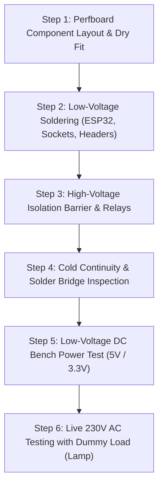

# 19_Hardware_Fabrication_and_Making_Manual.md
# 🛠️ SmartHome Prototype — Step-by-Step Hardware Fabrication & Assembly Manual

**Audience:** Electronics Makers, IoT Engineers, Electrical Technicians  
**Target:** Turning the BOM & Wokwi Simulation Schematics into Robust Physical Hardware (Perfboard & Modular Switchboard Ready)  
**Standard:** Professional Solder Standards (IPC-A-610), IS 732 Wiring Code

---

## 1. Required Tools & Workshop Equipment

Before commencing physical fabrication, ensure the following tools are available:

| Tool | Specification / Recommended Type | Purpose |
|---|---|---|
| **Soldering Iron** | 60W Temperature-Controlled (ESD-Safe, 300–350°C) | Soldering headers, terminal blocks & passive components |
| **Solder Wire** | 60/40 Lead-Tin or 63/37 Rosin Core (0.8mm diameter) | Clean, shiny solder joints with minimal flux residue |
| **Multimeter** | Digital Multimeter with Continuity Buzzer & True-RMS | Tracing continuity, checking for short circuits & verifying voltages |
| **Wire Stripper & Cutter** | Precision 20–30 AWG & Heavy-Duty 14–18 AWG | Clean wire stripping without nicking copper strands |
| **Crimping Tool & Ferrules** | Bootlace Ferrules (0.5mm² to 2.5mm²) | Terminating mains stranded copper wires into screw terminal blocks |
| **Heat Shrink Tubing** | 2mm, 4mm, 6mm Polyolefin Heat Shrink + Heat Gun | Insulating exposed 230V AC joints and sensor lead splices |
| **Hot Glue / Neutral Silicone** | Non-conductive electronics grade silicone / RTV | Mechanical strain relief for sensor wires and vibration dampening |
| **Anti-Static ESD Wrist Strap**| 1 MΩ resistance ground strap | Preventing ESD damage to ESP32 SoC and CMOS sensors |

---

## 2. Wire Gauge & Color Coding Standards

Always adhere strictly to standard wire cross-sections and color coding:

```
+-------------------------------------------------------------------------------+
|                      SYSTEM WIRING SPECIFICATION TABLE                        |
+-------------------------------------------------------------------------------+
| Purpose            | Voltage   | Recommended Gauge | Standard Indian Color    |
|--------------------|-----------|-------------------|--------------------------|
| Mains Phase / Live | 230V AC   | 1.5 - 2.5 sq mm   | Red / Brown              |
| Mains Neutral      | 230V AC   | 1.5 - 2.5 sq mm   | Black / Blue             |
| Mains Earth        | 0V        | 1.5 - 2.5 sq mm   | Green / Green-Yellow     |
| DC Power (+5V/+12V)| 5V/12V DC | 0.5 - 0.75 sq mm  | Red                      |
| DC Power (+3.3V)   | 3.3V DC   | 0.5 sq mm         | Orange / Yellow          |
| DC Ground (0V)     | 0V DC     | 0.5 - 0.75 sq mm  | Black                    |
| Digital GPIO / I2C | 3.3V Logic| 0.25 - 0.35 sq mm | Blue / Yellow / Magenta  |
| Analog ADC Signals | 0 - 3.3V  | 0.25 sq mm        | White / Violet           |
+-------------------------------------------------------------------------------+
```

---

## 3. General Assembly Workflow (Bench to Wall)

Follow this 6-step fabrication process for every node:



---

## 4. Detailed Node-by-Node Making Instructions

### Node Type A: Smart Room Light & Fan Retrofit (NODE-D1 / Sim 08)
*Components:* ESP32-WROOM DevKit, Hi-Link HLK-PM01 (5V 1A), 2x 5V Optocoupler Relays, RC Snubber Module, AM312 PIR, LDR, DHT22, 2x 2-Pin Screw Terminals.

1. **Step A1 (Power Module Isolation):**
   - Place the Hi-Link HLK-PM01 on one edge of a 5x7cm FR4 perfboard.
   - Solder AC-IN pins to a 2-pin 5.08mm pitch high-voltage screw terminal block.
   - **Crucial:** Cut an air gap / physical slot (at least 5mm wide) in the perfboard between the AC-IN pins and DC-OUT pins to provide galvanic creepage isolation.
2. **Step A2 (ESP32 Mounting):**
   - Solder two female pin header strips (19 pins each) on the perfboard so the ESP32 can be plugged in and removed easily.
3. **Step A3 (Relay Coil & Transistor Drivers):**
   - Route `GPIO19` to the Light Relay `IN1` and `GPIO18` to the Fan Relay `IN2`.
   - Connect the Relay Board `VCC` to +5V and `GND` to common GND.
4. **Step A4 (RC Snubber Integration):**
   - Solder the RC snubber module (0.1µF 400V capacitor + 100Ω 2W resistor) directly across the Fan Relay `COM` and `NO` terminal screws.
5. **Step A5 (Sensor Lead Harnessing):**
   - Solder 3-pin JST-XH or female dupont headers for:
     - PIR: VCC (3.3V), OUT (`GPIO13`), GND.
     - LDR: VCC (3.3V), Analog Out (`GPIO34`), 10kΩ pull-down to GND.
     - DHT22: VCC (3.3V), Data (`GPIO23`), GND (+ 4.7kΩ pull-up to 3.3V).
6. **Step A6 (Dry Contact Wall Switch Terminals):**
   - Solder a 4-pin screw terminal block. Connect terminal pairs to `GPIO25`-GND and `GPIO26`-GND for the existing mechanical wall switches.

---

### Node Type B: Kitchen Gas Safety & Emergency Solenoid (NODE-B1 / Sim 04)
*Components:* ESP32, MQ-6 Gas Sensor, Active Piezo Buzzer (5V), 12V 1A Power Supply, 12V Solenoid Valve Driver Relay, 5V Exhaust Relay.

1. **MQ-6 Gas Sensor Conditioning:**
   - MQ-6 sensor requires a 5V heater supply. Connect sensor VCC to +5V.
   - Connect the sensor analog output via a voltage divider (2kΩ and 3.3kΩ precision metal film resistors) to scale the 0–5V analog signal down to 0–3.1V for ESP32 `GPIO34`.
   - **Mandatory:** Power the sensor on the bench continuously for **24 to 48 hours** before deployment to burn in the chemical tin-dioxide ($SnO_2$) sensing element.
2. **Solenoid Relay Safety Interlock:**
   - Connect 12V DC power through a 1A inline fuse to the Gas Solenoid Relay.
   - Wire the solenoid valve to the **Normally-Open (NO)** contacts such that when power fails, the valve defaults to CLOSED.

---

### Node Type C: Whole-House Power Monitor & Load Shedder (NODE-E1 / Sim 09)
*Components:* ESP32, PZEM-004T v3.0 AC Power Sensor (or SCT-013 Split-Core CT Clamp), I2C LCD/OLED, 16A Contactor Driver Relay.

1. **Current Transformer (CT) Clamping:**
   - **Never clamp both Live and Neutral simultaneously** in a CT sensor. Pass ONLY the main incoming Phase (Live) wire through the center hole of the CT clamp.
2. **UART Galvanic Isolation:**
   - Connect PZEM-004T TX to ESP32 `GPIO16` (RX2) and PZEM-004T RX to ESP32 `GPIO17` (TX2).
   - PZEM-004T modules feature built-in optocouplers. Ensure low-voltage DC GND is kept completely isolated from the AC side.
3. **Contactor Control for High Amperage:**
   - For appliances drawing >10A (ACs, geysers), **do not run high current through small PCB relays**. Connect the ESP32 relay to energize the 230V coil of a modular 25A DIN-rail AC Contactor (Schneider / L&T / Havells).

---

## 5. Quality Assurance & Pre-Commissioning Testing Checklist

Before applying 230V AC mains power to any assembled board, complete every checkpoint:

- [ ] **Visual Solder Inspection:** Check all solder joints under magnification. Confirm joints are concave, shiny, and free of solder bridges or cold solder cracks.
- [ ] **High-Voltage Air Gap Verification:** Confirm at least **6.3 mm clearance** between any 230V AC copper trace and low-voltage 3.3V/5V DC traces.
- [ ] **Cold Continuity Test (Multimeter Buzzer):**
  - Probe between 5V/3.3V rail and GND: Must show **NO continuity** (open / high resistance).
  - Probe between AC Phase and Neutral on unpowered board: Must show **NO continuity**.
  - Probe between AC Phase and ESP32 GND: Must show **infinite resistance**.
- [ ] **DC Power-Up (5V USB / Lab PSU):** Plug in 5V DC via USB. Check 3.3V output on ESP32 regulator pin. Confirm 3.3V ± 0.05V.
- [ ] **Firmware Flash & Telemetry:** Flash the respective test firmware and observe the Serial Monitor at 115200 baud to ensure clean sensor readings.
- [ ] **AC Load Test with 60W Incandescent Lamp:** Connect a 60W test lamp in series with the AC mains input as a current-limiting safety ballast during initial mains testing.

---

## 6. Enclosure & Mounting Specifications

1. **Material:** Use fire-retardant **ABS plastic enclosures (UL94-V0 rated)** or IP65 weather-sealed enclosures for bathrooms, kitchens, water tanks, and garden zones.
2. **Ventilation:** Drill 2mm downward-angled ventilation slots for heat dissipation away from moisture ingress paths.
3. **Cable Entry:** Use PG7 / PG9 nylon cable glands for water-tight cable entry on outdoor nodes.
