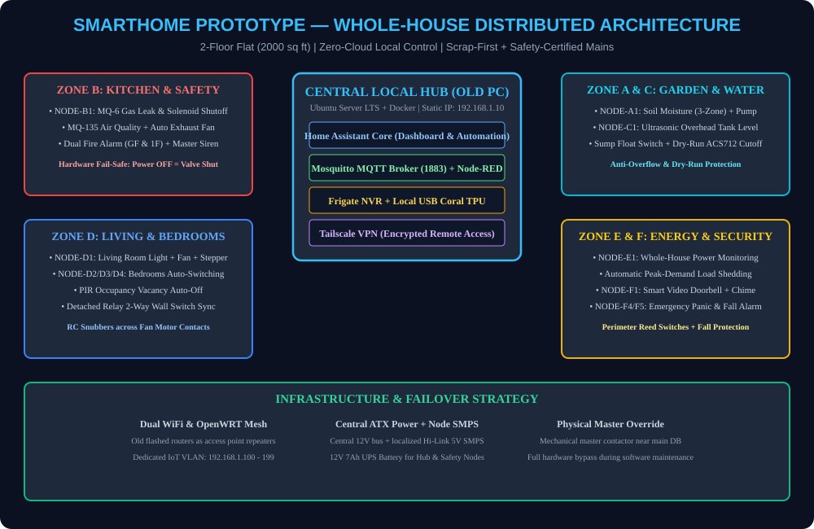

# 🏠 SmartHome & Commercial IoT Prototype — Whole-House & Retail Automation

> **From scrap to smart — a complete, local, privacy-first IoT automation system built with ESP32 microcontrollers, Home Assistant, 11 interactive Wokwi simulations, modular switchboard retrofits, and commercial retail shop extensions.**

---

## 🌐 Whole-House Distributed Architecture

> **🖼️ Complete Visual Schematics Gallery:** Browse all 13 interactive SVG schematics in the [**Photos & Visual Schematics Directory**](./photos/README.md).

---

## 📋 Features & Simulation Coverage (11 Testbeds + Commercial)

| # | System Feature | Interactive Wokwi Simulation | Visual SVG Schematic |
|:---:|---|---|---|
| **01** | PIR Motion Auto-Lighting | [simulations/01_pir_motion_light/](./simulations/01_pir_motion_light/README.md) | [01_pir_motion_light.svg](./photos/wiring/01_pir_motion_light.svg) |
| **02** | Climate & Fan Hysteresis | [simulations/02_dht22_climate/](./simulations/02_dht22_climate/README.md) | [02_dht22_climate_fan.svg](./photos/wiring/02_dht22_climate_fan.svg) |
| **03** | Garden Auto-Watering & Anti-Flood | [simulations/03_soil_moisture_pump/](./simulations/03_soil_moisture_pump/README.md) | [03_soil_moisture_pump.svg](./photos/wiring/03_soil_moisture_pump.svg) |
| **04** | Kitchen Gas Leak & Auto Shutoff | [simulations/04_gas_leak/](./simulations/04_gas_leak/README.md) | [04_kitchen_gas_safety.svg](./photos/wiring/04_kitchen_gas_safety.svg) |
| **05** | Water Tank Level & Dry-Run Protection | [simulations/05_water_tank/](./simulations/05_water_tank/README.md) | [05_water_tank_ultrasonic.svg](./photos/wiring/05_water_tank_ultrasonic.svg) |
| **06** | Reed Switch Perimeter Security | [simulations/06_reed_door/](./simulations/06_reed_door/README.md) | [06_reed_door_security.svg](./photos/wiring/06_reed_door_security.svg) |
| **07** | Stepper Motorized Curtains | [simulations/07_stepper_curtain/](./simulations/07_stepper_curtain/README.md) | [07_stepper_curtain.svg](./photos/wiring/07_stepper_curtain.svg) |
| **08** | **Smart Room Fan & Light Auto-Switch** | [simulations/08_smart_room_light_fan_auto_switch/](./simulations/08_smart_room_light_fan_auto_switch/README.md) | [08_smart_room_fan_light_switchboard.svg](./photos/wiring/08_smart_room_fan_light_switchboard.svg) |
| **09** | **Mains Energy Monitor & Load Shedder** | [simulations/09_energy_monitor_load_shedding/](./simulations/09_energy_monitor_load_shedding/README.md) | [09_energy_monitor_load_shedding.svg](./photos/wiring/09_energy_monitor_load_shedding.svg) |
| **10** | **Indoor Air Quality & Auto Exhaust** | [simulations/10_air_quality_auto_exhaust/](./simulations/10_air_quality_auto_exhaust/README.md) | [10_air_quality_auto_exhaust.svg](./photos/wiring/10_air_quality_auto_exhaust.svg) |
| **11** | **Smart Doorbell, Panic & Fall Alarm** | [simulations/11_smart_doorbell_panic_fall/](./simulations/11_smart_doorbell_panic_fall/README.md) | [11_smart_doorbell_panic_fall.svg](./photos/wiring/11_smart_doorbell_panic_fall.svg) |
| **12** | **Commercial Shop & Heavy Appliances** | *Full Design & Wiring Specification* | [12_commercial_shop_automation.svg](./photos/wiring/12_commercial_shop_automation.svg) |

---

## 💰 Cost Comparison

- **Total DIY Prototype Cost:** ₹37,500 (~$450 USD) for 15 nodes across 2 floors
- **Commercial Equivalent (Control4 / Crestron / Schneider):** ₹2,00,000+ ($2,400+ USD)
- **Net Cost Savings:** > 80%

---

## 📁 Complete Repository Document Index

| File | Purpose & Description |
|---|---|
| [**00_Project_Master_Plan.md**](./00_Project_Master_Plan.md) | Whole-house vision, scope, milestones & commercialization roadmap |
| [**01_System_Architecture_and_Hub_Setup.md**](./01_System_Architecture_and_Hub_Setup.md) | Ubuntu server hub, Docker stack, static IP map & mesh WiFi |
| [**02_Node_Clubbing_BOM_and_Cost.md**](./02_Node_Clubbing_BOM_and_Cost.md) | Node zone clubbing, GPIO assignments & complete BOM |
| [**03_Scrap_Reuse_Guide.md**](./03_Scrap_Reuse_Guide.md) | Repurposing scrap PCs, routers, webcams & ATX power supplies |
| [**04_Simulation_Guide_Wokwi.md**](./04_Simulation_Guide_Wokwi.md) | Wokwi simulation guide & testing methodology |
| [**05_Sensor_Actuator_Specifications.md**](./05_Sensor_Actuator_Specifications.md) | Component pinouts, electrical ratings & sensor characteristics |
| [**06_ESPHome_YAML_Configurations_All_Nodes.md**](./06_ESPHome_YAML_Configurations_All_Nodes.md) | Complete production-ready ESPHome YAML firmware |
| [**07_Home_Assistant_Configuration_and_Dashboard.md**](./07_Home_Assistant_Configuration_and_Dashboard.md) | HA dashboards, Lovelace UI cards & MQTT entity configs |
| [**08_Node_RED_Automations.md**](./08_Node_RED_Automations.md) | Complex stateful automation flows & safety interlocks |
| [**09_Safety_Guidelines.md**](./09_Safety_Guidelines.md) | ⚠️ Electrical 230V AC, gas, water & Li-ion battery safety rules |
| [**10_Procurement_India_Links.md**](./10_Procurement_India_Links.md) | Direct procurement links for Indian stores (Robu, Evelta, Amazon) |
| [**11_Testing_Checklist.md**](./11_Testing_Checklist.md) | 4-phase testing & 30-day commissioning checklist |
| [**12_DIY_vs_ReadyMade_Recommendations.md**](./12_DIY_vs_ReadyMade_Recommendations.md) | Build vs buy decisions matrix |
| [**13_Cost_Estimate_Summary.md**](./13_Cost_Estimate_Summary.md) | Detailed cost breakdown by zone & component |
| [**14_Commercialization_PCB_Design_and_Selling.md**](./14_Commercialization_PCB_Design_and_Selling.md) | EasyEDA / JLCPCB custom PCB roadmap & pricing models |
| [**15_README_For_Each_Node.md**](./15_README_For_Each_Node.md) | Node-by-node quick reference & troubleshooting |
| [**16_Learning_Path_and_References.md**](./16_Learning_Path_and_References.md) | ELI5 fundamentals, protocols & reference links |
| [**17_GitHub_Repository_Structure_and_README.md**](./17_GitHub_Repository_Structure_and_README.md) | Repository organization & engineering standards |
| [**18_Real_Home_Installation_Switchboard_Wiring_Guide.md**](./18_Real_Home_Installation_Switchboard_Wiring_Guide.md) | Modular switchboard retrofit, 2-way sync & snubbers |
| [**19_Hardware_Fabrication_and_Making_Manual.md**](./19_Hardware_Fabrication_and_Making_Manual.md) | Step-by-step soldering, perfboard assembly & making manual |
| [**20_Commercial_Shop_and_Appliance_Automation_Guide.md**](./20_Commercial_Shop_and_Appliance_Automation_Guide.md) | Retail shop, cold-chain, glow-sign & heavy appliance guide |
| [**21_Industry_Standards_IS_IEC_Compliance_and_AC_Safety.md**](./21_Industry_Standards_IS_IEC_Compliance_and_AC_Safety.md) | IS 732, IS 13947 & IEC 60669 electrical compliance |
| [**22_MOQ_Bulk_Procurement_and_Hardware_Optimization_Guide.md**](./22_MOQ_Bulk_Procurement_and_Hardware_Optimization_Guide.md) | Wholesale MOQ batch buying & microcontroller minimization guide |
| [**PROCUREMENT_AND_MOQ_README.md**](./PROCUREMENT_AND_MOQ_README.md) | Standalone procurement manual & supplier links |
| [**AUDIT/00_MASTER_AUDIT.md**](./AUDIT/00_MASTER_AUDIT.md) | Initial engineering pre-build audit report |
| [**AUDIT/01_PROTOTYPE_PHOTO_MASTER_PROMPT.md**](./AUDIT/01_PROTOTYPE_PHOTO_MASTER_PROMPT.md) | Ready-to-paste AI image generation prompts for visual renders |
| [**AUDIT/02_COMPLETE_MASTER_POST_AUDIT.md**](./AUDIT/02_COMPLETE_MASTER_POST_AUDIT.md) | Master complete post-audit & verification sign-off |

---

## 🛒 MOQ Batch Buying & Microcontroller Optimization

> **How we minimized 40+ microcontrollers down to just 15:**
> - **Zone Clubbing:** 1 ESP32 (₹310 in 10-pack MOQ) runs 4 relays, 4 wall switch inputs, and multiple I2C sensors simultaneously.
> - **Wholesale MOQ Savings:** Buying in 5-pack and 10-pack batches from authorized distributors (Robu.in / Evelta) reduces per-unit costs by **35% to 55%**.
> - **Full Details:** Read the dedicated [**Procurement & MOQ Strategy Guide**](./PROCUREMENT_AND_MOQ_README.md).

---

## ⚡ 230V AC Safety & IS/IEC Standards Compliance

1. **Galvanic Isolation:** All mains relays feature optocouplers with 2.5kV isolation and $\ge 6.3\text{mm}$ creepage clearance.
2. **Surge Suppression:** MOV `14D471K` surge arrestors protect against Indian grid voltage spikes.
3. **Inductive Snubber Networks:** RC snubbers (0.1µF 400V + 100Ω) across all ceiling fan contacts prevent motor back-EMF arcing.
4. **Code Compliance:** Designed in accordance with **IS 732 (2019)**, **IS 13947**, and **IEC 60669-2-1**.

---

## 📜 License
MIT License. Free to use, modify, and commercialize with attribution.
